# GlucoSim

JAX-based blood glucose simulation environments for studying safe generalization
across safe reinforcement learning algorithms.

GlucoSim provides Gymnasium-style environments for Type 1 and Type 2 diabetes
virtual patients. Each step returns both a **reward** and a **safety cost**, making
the environments directly usable as constrained MDPs (CMDPs).

> **Research use only.** This simulator is a research tool for studying
> reinforcement learning algorithms. It is **not** a medical device, has not been
> validated for clinical use, and must never be used to make treatment decisions
> for real patients.

This repository contains the simulator only. For the safe RL algorithms evaluated
against it, see [GlucoAlg](https://github.com/safe-autonomy-lab/GlucoAlg).

## Blood glucose dynamics

Three-hour simulations for `adolescent#001` with default process/action noise
and circadian modulation enabled. Columns show diabetes types;
the main panels show fasting, meal-only, and meal-plus-bolus responses. All panels use
the same axes and show plasma
glucose (`Gp / Vg`) plus a separate simulated CGM readout, with the
70–180 mg/dL band shaded green.

| T1D | T2D | T2D no-pump |
| :---: | :---: | :---: |
| **Fasting**<br>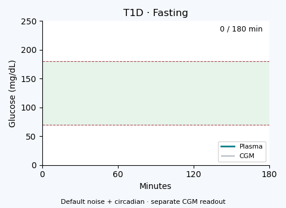 | **Fasting**<br>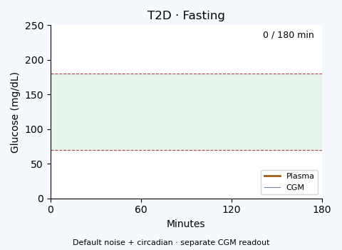 | **Fasting**<br>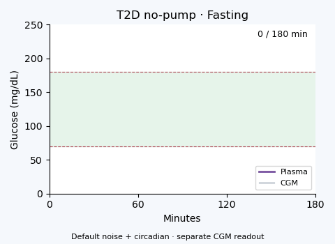 |
| **Meal only**<br>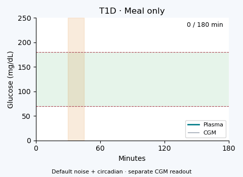 | **Meal only**<br>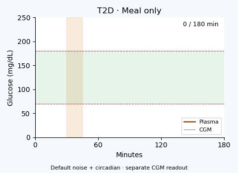 | **Meal only**<br>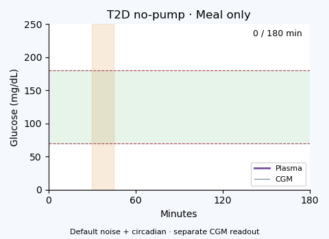 |
| **Meal + bolus**<br>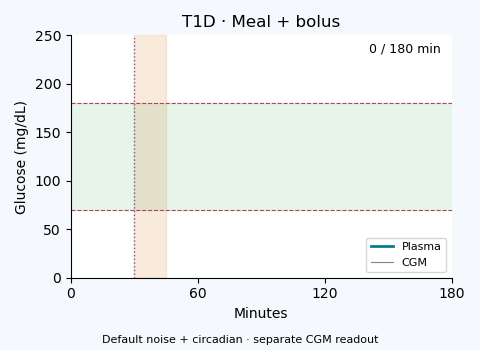 | **Meal + bolus**<br>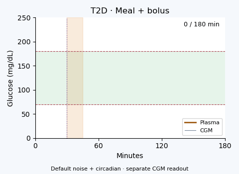 | **Meal + bolus**<br>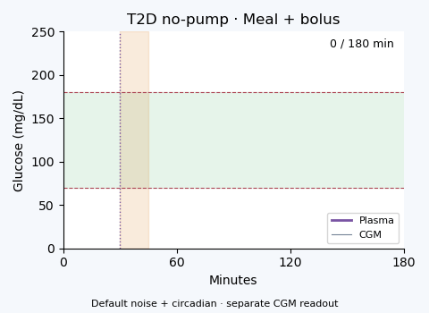 |

<details>
<summary>More scenarios: bolus-only and direct-ODE exercise</summary>

| T1D | T2D | T2D no-pump |
| :---: | :---: | :---: |
| **Bolus only**<br>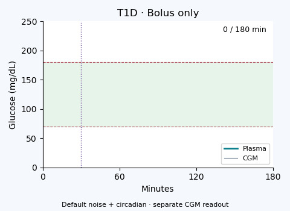 | **Bolus only**<br>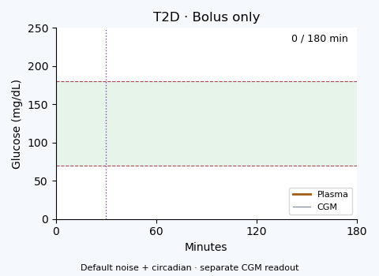 | **Bolus only**<br> |
| **Exercise**<br>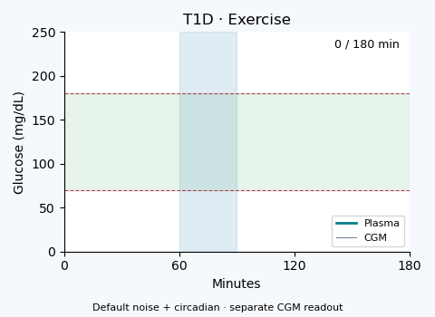 | **Exercise**<br>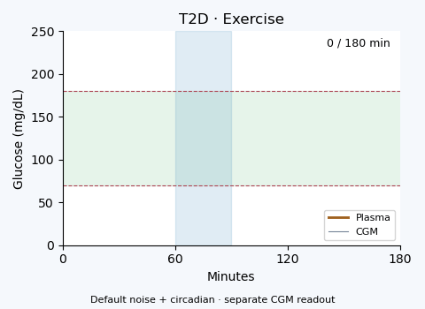 | **Exercise**<br>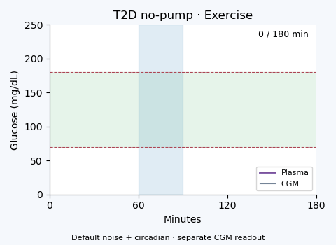 |

</details>

Meal: **60 g over minutes 30–45**. Bolus-only: **2 U at minute 30**;
meal plus bolus: **4 U at minute 30**. Exercise: **50% heart-rate reserve
from minutes 60–90**, through the direct simulation interface.

Low-glucose outcomes remain visible; enabling noise is not a safety fix.
These direct-ODE runs use a fixed three-hour horizon and **no episode
termination policy**. They illustrate
model dynamics, not dosing recommendations or validated controller performance.

<details>
<summary>Parameter settings, limitations, and rendering</summary>

These examples reuse the calibration-checkpoint patient settings; they are not
matched-physiology comparisons or default-patient benchmarks. All use direct
initialization tuning (without the Gym reset’s 72-hour warmup) and seed 42,
with these explicit overrides:

| T1D | T2D | T2D no-pump |
| --- | --- | --- |
| `k1=0.07`, `Km0=240`, `kp2=0.003` | `HEb=0.5`, `Ib=120`, `m4=0.2` | `HEb=0.5`, `m4=0.2` |

No-pump retains its distinct physiological preset and no continuous basal
pump delivery; the bolus scenarios supply explicit insulin input directly.
Exercise is supported here through direct ODE inputs, not the public Gym action
space. Only these 15 fixed scenarios were rerun with default noise enabled;
no physiology, doses, parameters, or noise magnitudes were retuned. The
[earlier noise-off animations](docs/assets/glucose) remain available.

[`examples/render_glucose_gif.py`](examples/render_glucose_gif.py) renders all
15 panels from saved NPZ traces, verifies their hashes against `summary.json`,
and embeds each input hash in its GIF. CGM uses the existing sensor model with an independent PRNG stream
(`fold_in(PRNGKey(42), 1)`) so sensor sampling cannot change physiology. Missing
readings remain gaps; the sensor clips reported values to 40–400 mg/dL. This is
a standalone readout, not the complete Gym observation pipeline.
Raw experiment files remain outside Git:

```bash
JAX_PLATFORMS=cpu python -m examples.generate_readme_traces --output-dir /new/traces
python examples/render_glucose_gif.py --trace-dir /new/traces --output-dir /new/gallery
```

The scenario example also supports GIF output via
[`examples/run_scenarios.py --gif`](examples/run_scenarios.py).

</details>

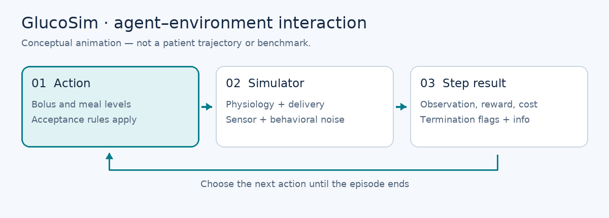

*Conceptual interaction loop; this animation is not a simulated glucose trace.*

## Installation

Requires Python >= 3.10.

```bash
git clone https://github.com/safe-autonomy-lab/GlucoSim.git
cd GlucoSim
python -m pip install -e .
```

Or install just the dependencies and run from source:

```bash
python -m pip install -r requirements.txt
```

The core package depends on `jax`, `gymnasium`, `numpy`, `pandas`, and
`matplotlib`. PyTorch is **optional** and only needed for the OmniSafe CMDP
wrapper (see below). JAX runs on CPU by default; install a CUDA-enabled `jaxlib`
if you want GPU execution.

## Quickstart

The package registers `t1d-v0`, `t2d-v0`, and `t2d_no_pump-v0` in a local
registry on import (separate from Gymnasium's global registry):

```python
import numpy as np
import glucosim  # registers t1d-v0 / t2d-v0 / t2d_no_pump-v0
from glucosim import gym_env as gym

env = gym.make(
    "t1d-v0",
    simulation_minutes=24 * 60,   # episode length; minimum is one day
    sample_time=5,                # controller interval (minutes per step)
    patient_name="adolescent#001",
)

obs, info = env.reset(seed=42)
for _ in range(10):
    action = env.action_space.sample()  # [bolus_level, meal_level], 5 levels each
    obs, reward, cost, terminated, truncated, info = env.step(action)
    if terminated or truncated:
        break
```

Note the **six-tuple** step return: `(obs, reward, cost, terminated, truncated,
info)`. This is why GlucoSim ships its own `gym_env` registry instead of using
Gymnasium's `make` directly.

A complete runnable example that simulates 24 hours and prints time-in-range and
other glycemic metrics lives in [`examples/basic_rollout.py`](examples/basic_rollout.py):

```bash
python examples/basic_rollout.py --seed 42 --plot cgm.png
```

### Key environment knobs

- `simulation_minutes`: total episode length in minutes (rounded up to >= 1 day).
- `sample_time`: controller interval in minutes per step (default 5).
- `patient_name`: a row from `glucosim/simglucose/params/vpatient_params.csv`
  (cohorts: `child#0XX`, `adolescent#0XX`, `adult#0XX`).
- `patient_overrides`: physiological overrides, see below.

### Observation and action spaces

- **Observation** (14-D `Box`): CGM (mg/dL), bolus insulin-on-board (U),
  carbs-on-board (g), CGM trend, time-of-day (sin/cos), normalized
  time-since-meal/bolus, pending meal buffer, daily meal/bolus counts, time
  until the next scheduled meal, its size, and a pre-bolus-window flag.
- **Action** (`MultiDiscrete([5, 5])`): `[bolus_level, meal_level]` where level
  0 is "do nothing" and levels 1-4 map linearly to the patient's maximum bolus
  (default 10 U) and maximum meal (default 80 g). Action acceptance is gated by
  behavioral rules (safety windows, daily limits, hypo/hyper overrides); the
  `info` dict reports `bolus_accepted` / `meal_accepted` and block reasons.
- **Cost**: a graded danger signal derived from a short glucose forecast; it is
  zero in the 70-180 mg/dL range and grows for hypoglycemia (<70, severe <54)
  and hyperglycemia (>180, severe >250), with hypoglycemia weighted more
  heavily. Episodes terminate early if blood glucose leaves (10, 600) mg/dL.

### Noise, circadian rhythm, and initially flat traces

Both stochastic effects and circadian modulation are implemented. The previous
noise-off gallery used `NoiseConfig.enable=False`, which disables **both**.
Those runs started from a tuned fasting state with no meal or bolus until
minute 30, so an initially flat T2D trace was expected.

The noise-on gallery uses the existing defaults: meal/insulin delivery variation,
possible missed boluses, pump-basal variation, glucose/insulin process noise,
and a separate CGM model with measurement noise, drifting bias, and dropouts.
No artificial jitter is added by the renderer.

Circadian modulation changes hepatic glucose drive with the factor
`1 + 0.03 * sin(2π * (t_minutes - 240) / 1440)`. Its period is 24 hours;
240 minutes is a phase offset, not the peak. The 3% amplitude applies to
hepatic drive, **not directly to blood glucose**. T1D applies the adjustment
through `kp1`; T2D/no-pump use their insulin-suppressed `EGP_0` contribution.
A three-hour GIF shows only part of this cycle. Noise and this simplified
rhythm do not establish clinical realism.

See [noise settings](glucosim/simglucose/core/params.py),
[disturbances and circadian factor](glucosim/simglucose/sim/realism.py), and
[CGM measurement](glucosim/simglucose/sim/sensor.py).

### Exercise: implemented physiology, inactive Gym action

**Exercise is not currently an action in the public Gym environment.** Its action
is `[bolus_level, meal_level]`; the wrapper always supplies `exercise=0.0`.
A policy cannot request an exercise session by adding a third action component.
See the [action mapping](glucosim/simglucose/sim/env.py).

The lower-level simulator still implements exercise in both T1D and T2D
(including no-pump):

- **Direct ODE input:** `[carb_g_per_min, insulin_U_per_min, hr_reserve]`.
  `hr_reserve` is an intensity fraction, not a duration. The gallery sets it to
  `0.5` from minute 60 up to minute 90 and to zero otherwise, with no meal or
  bolus input in that exercise scenario.
- **Heart-rate response:** the model uses `HR_max = 220 - age` and
  `HR = HR0 + hr_reserve * (HR_max - HR0)`. Thus `0.5` means halfway between
  resting and estimated maximum heart rate, not 50% of maximum heart rate.
- **Glucose response:** exercise states track heart-rate elevation (`E1`) and
  slower response/recovery (`T_E`, `E2`). Their terms alter plasma-to-tissue
  glucose transfer and add tissue glucose uptake. The effects build and decay
  over time rather than switching glucose instantly. These are empirical
  model couplings, not a clinically validated exercise prescription.

There is also internal behavioral session logic: a lower-level `Action.exercise`
request specifies a fraction of `max_exercise_min`, subject to acceptance and
meal/safety-window checks; an accepted session samples intensity in `[0.3, 0.8)`.
That duration request is **different from the ODE intensity input** and is not
exposed by the current Gym wrapper. The exercise GIFs bypass this behavioral
request path and supply the prescribed intensity directly.

Sources: [exercise equations](glucosim/simglucose/physiology/vector_fields.py),
[session scheduling](glucosim/simglucose/sim/step.py), and
[direct scenario inputs](examples/characterize_simulator.py).

## Reproducibility

`env.reset(seed=...)` re-creates the simulator's master JAX PRNG key, so a fixed
seed reproduces the full episode (meal scenario, sensor noise, and behavioral
noise) exactly:

```python
obs_a, _ = env.reset(seed=42)   # episode A
obs_b, _ = env.reset(seed=42)   # identical to episode A
```

For exact comparisons, use the same source, inputs, actions, seed, Python/JAX/
jaxlib/NumPy versions, backend, and numerical settings (including JAX x64).
Use `JAX_PLATFORMS=cpu` to fix the backend; CPU execution alone does not
guarantee equality across different runtimes.

## Patient randomization / generalization

You can generate patient variation **without adding new CSVs** by sampling
`patient_overrides` at env creation time:

- `carb_absorption_scale` (scales `kmax`, `kabs`)
- `insulin_sensitivity_scale` (scales `Vmx`)
- `autobalance_basal_scale` / `autobalance_hepatic_scale` (shift basal steady state)
- `eat_rate_scale` (meal intake rate)

```python
import numpy as np
import glucosim
from glucosim import gym_env as gym

rng = np.random.default_rng(0)
overrides = {
    "carb_absorption_scale": rng.uniform(0.8, 1.2),
    "insulin_sensitivity_scale": rng.uniform(0.8, 1.2),
    "autobalance_basal_scale": rng.uniform(0.85, 1.15),
    "eat_rate_scale": rng.uniform(0.85, 1.15),
}

env = gym.make("t1d-v0", patient_name="adult#001", patient_overrides=overrides)
```

### Effective inputs and derived volumes

Covered physiological overrides describe the **effective patient**: `BW=100`
means a final body weight of 100 kg, including for T2D no-pump. They are resolved
before the conversion/calibration stages that consume them. Unlisted overrides
retain their existing late-override behavior; see the
[factory contract](glucosim/simglucose/core/params.py) for type-specific rules.


`V_G_L` and `V_I_L` are computed read-only properties. Changing `BW`, `Vg`, or
`Vi` with `dataclasses.replace` immediately updates both totals. Set those
inputs, rather than passing derived volumes as overrides:

```python
from glucosim.simglucose.core.params import create_patient_params

patient = create_patient_params("adult#001", diabetes_type="t2d", BW=100)
print(patient.V_G_L)  # patient.BW * patient.Vg / 10, in liters
print(patient.V_I_L)  # patient.BW * patient.Vi, in liters
```

**Compatibility change:** `V_G` and `V_I` were removed without aliases.
All four volume names are rejected as factory overrides and are no longer
constructor or `dataclasses.replace` fields. Dataclass payloads omit these
four stored fields, and the PyTree has four fewer leaves. Old pickles containing
stored volumes are explicitly rejected; reconstruct patients from authoritative
inputs. New pickle round-trips are supported.

T2D no-pump remains a physiological **and** delivery preset, not just
`use_pump=False`. A resolved `use_pump=False` requires `basal=0`.
`autobalance_enabled=False` disables T1D factory calibration only; it does not
disable reset-time initialization tuning.

## OmniSafe / CMDP usage (optional)

`glucosim/diabetes_cmdp.py` wraps the simulator as an OmniSafe `CMDP`. It
requires extra dependencies that are **not** installed by default:

```bash
pip install torch omnisafe stable-baselines3
```

```python
from glucosim.diabetes_cmdp import DiabetesEnvs

cmdp = DiabetesEnvs(
    env_id="t1d-v0",
    device="cpu",
    num_envs=1,
    simulation_minutes=24 * 60,
    sample_time=5,
    patient_name="adolescent#001",
)
obs, info = cmdp.reset()
```

Note: OmniSafe's own Python-version support may lag behind this package; the
bundled `safety_gymnasium` compatibility layer is kept in-tree for that reason.

## Why both `gym_env` and `safety_gymnasium`?

Both folders provide Gymnasium-style APIs with costs, but for different consumers:

- `glucosim/gym_env`: a local registry whose `make(...)` returns environments
  with the six-tuple `(obs, reward, cost, terminated, truncated, info)` step API.
- `glucosim/safety_gymnasium`: a Safety-Gymnasium compatibility layer (vector
  envs and wrappers that preserve cost signals) used by OmniSafe-style workflows,
  updated to work with Python >= 3.10.

## Running the tests

```bash
python -m pip install -e '.[test]'
JAX_PLATFORMS=cpu python -m pytest
```

The suite covers construction, initialization/reset, JAX behavior, serialization,
and characterization verification. Runtime depends on hardware and compilation. The first reset of a patient configuration JIT-compiles the
simulator and runs a 72-hour basal-only warmup; the result is cached per
configuration within a process.

The characterization harness supports smoke, full, and sharded captures with
strict provenance and coverage checks; see
[`examples/characterize_simulator.py`](examples/characterize_simulator.py) and
[`examples/characterization_shards.py`](examples/characterization_shards.py).

The README schematics can be regenerated with `python examples/render_readme_assets.py`
(optional documentation dependency: `Pillow`; no simulation is run).

## Known limitations

- Exercise is inactive in the public `[bolus_level, meal_level]` action space.
  Direct ODE exercise inputs remain available; see
  [the exercise explanation](#exercise-implemented-physiology-inactive-gym-action).
- Episode lengths shorter than one day are rounded up to one day.
- Sensor/behavioral noise is always enabled and is controlled only through the
  random seed; there is no public switch to disable it.
- The physiological model is a research adaptation of the UVA/Padova-style
  ODE model with behavioral layers on top; it has not been re-validated against
  clinical data in this repository.
- In the T1D model, insulin acts on EGP and glucose utilization through the
  *instantaneous* plasma insulin concentration; the remote insulin-action delay
  states (x1/x2/x3) are present for state compatibility with the T2D model but
  are intentionally not wired into the glucose equations. The subcutaneous
  absorption chain still provides the dominant insulin lag.

## Troubleshooting

- **`TypeError: Parameters to Generic[...]`** on import: fixed for
  gymnasium >= 1.3 on the current branch; upgrade GlucoSim.
- **First reset is slow**: JIT compilation plus a 72h warmup run once per
  patient configuration. Subsequent resets reuse a cached warm state.
- **Slow startup on GPU**: cuDNN autotuning can take minutes; set
  `JAX_PLATFORMS=cpu` unless you need GPU throughput.
- **`ImportError` from `glucosim.diabetes_cmdp`**: install the optional
  `torch`, `omnisafe`, and `stable-baselines3` dependencies.
- **Tests pass for you but fail elsewhere, or `import glucosim` loads an
  unexpected version**: an older `glucosim` may be installed in the same
  environment and shadowing this checkout. Run from a clean virtual
  environment, or confirm the source with
  `python -c "import glucosim; print(glucosim.__file__)"`.

## Models and datasets

Trained models and datasets are available on Hugging Face:
[safe-diabetes-benchmark](https://huggingface.co/safe-diabetes-benchmark).

## Contributing

See [CONTRIBUTING.md](CONTRIBUTING.md). Please run `python -m pytest` before
opening a pull request.

## License

This project is released under the [MIT License](LICENSE). Vendored
Gymnasium / Safety-Gymnasium / OmniSafe code in `glucosim/gym_env` and
`glucosim/safety_gymnasium` retains its original Apache-2.0 notices.

## Citation

If this repository was helpful to your research, please consider citing our work:

```bibtex
@inproceedings{kwon2026safetygeneralizationdistributionshift,
  title={Safety Generalization Under Distribution Shift in Safe Reinforcement Learning: A Diabetes Testbed},
  author={Minjae Kwon and Josephine Lamp and Lu Feng},
  booktitle={Forty-third International Conference on Machine Learning},
  year={2026},
  url={https://openreview.net/forum?id=kSUGLBHd0T}
}
```
