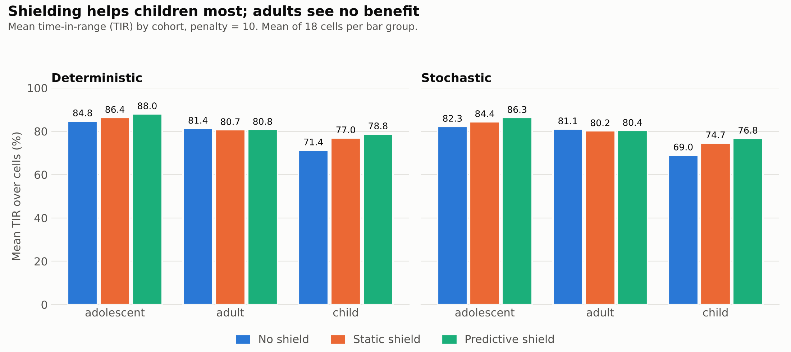
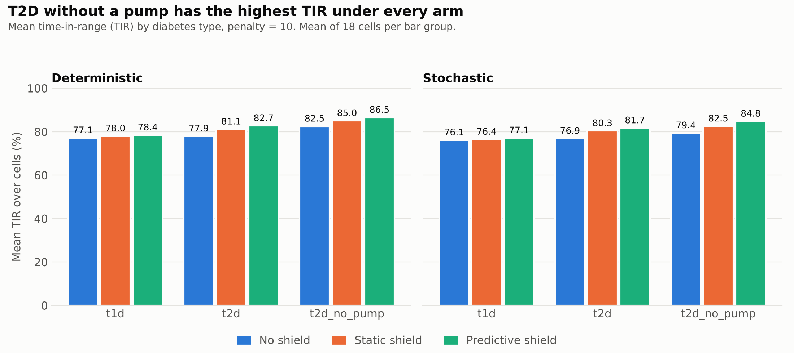
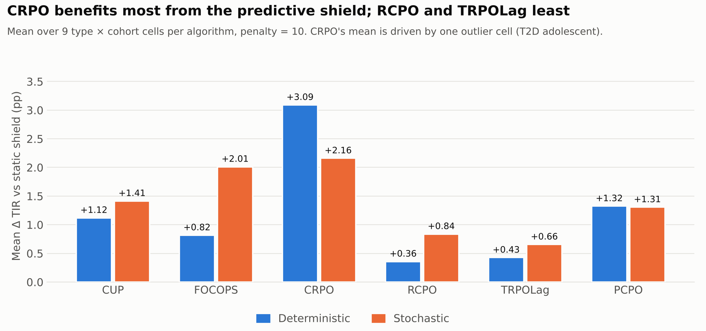
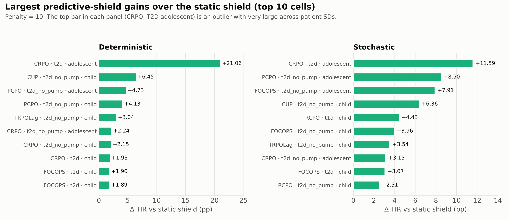

# Predictive shielding results (penalty = 10)

Time-in-range (TIR, %) on unseen patients (#002–#010) over the seven-day horizon, reported as mean ± SD. Each row compares the same trained policy with **no shield**, a **static shield**, and the **predictive shield** (penalty = 10). 6 algorithms × 3 diabetes types × 3 age cohorts = 54 cells per mode.

After fixing the simulator's meal absorption, background exercise noise, circadian glucose production, and initial glucose and insulin balances, we reran these experiments; numbers from earlier simulator versions are not directly comparable.

## Figures

Full tables follow below.

**Column key**

| Column | Meaning |
|---|---|
| None / Static / Predictive | TIR % with no shield / static shield / predictive shield |
| Δ vs none | Predictive − none, in percentage points (pp) |
| Δ vs static | Predictive − static, in pp; **bold** = at least +1.00 pp |

Type `t2d_no_pump` is T2D without an insulin pump. CRPO is the algorithm labelled OnCRPO in the generalization tables.

## Deterministic

| Algorithm | Type | Cohort | None TIR % | Static TIR % | Predictive TIR % | Δ vs none (pp) | Δ vs static (pp) |
|---|---|---|---:|---:|---:|---:|---:|
| CUP | t1d | adolescent | 92.06 ± 2.08 | 88.51 ± 2.86 | 88.49 ± 2.90 | -3.57 | -0.02 |
| CUP | t1d | adult | 49.74 ± 5.94 | 46.17 ± 6.21 | 46.86 ± 5.68 | -2.88 | +0.69 |
| CUP | t1d | child | 72.61 ± 5.16 | 83.29 ± 4.17 | 84.92 ± 3.32 | +12.31 | **+1.63** |
| CUP | t2d | adolescent | 72.70 ± 25.18 | 82.02 ± 12.03 | 82.78 ± 11.34 | +10.08 | +0.76 |
| CUP | t2d | adult | 82.04 ± 5.62 | 82.93 ± 5.32 | 83.06 ± 5.21 | +1.03 | +0.13 |
| CUP | t2d | child | 89.16 ± 1.85 | 90.08 ± 1.18 | 90.52 ± 0.81 | +1.36 | +0.44 |
| CUP | t2d_no_pump | adolescent | 95.39 ± 1.18 | 96.17 ± 0.79 | 96.17 ± 0.82 | +0.78 | +0.00 |
| CUP | t2d_no_pump | adult | 93.26 ± 3.73 | 93.74 ± 3.86 | 93.74 ± 3.86 | +0.49 | +0.00 |
| CUP | t2d_no_pump | child | 77.03 ± 14.55 | 79.36 ± 10.21 | 85.81 ± 5.91 | +8.78 | **+6.45** |
| FOCOPS | t1d | adolescent | 88.77 ± 4.67 | 87.04 ± 4.51 | 87.12 ± 4.43 | -1.65 | +0.08 |
| FOCOPS | t1d | adult | 48.40 ± 10.32 | 44.05 ± 9.01 | 44.29 ± 8.96 | -4.10 | +0.25 |
| FOCOPS | t1d | child | 81.15 ± 9.41 | 88.27 ± 4.87 | 90.17 ± 3.04 | +9.03 | **+1.90** |
| FOCOPS | t2d | adolescent | 97.09 ± 0.62 | 97.12 ± 0.65 | 97.10 ± 0.67 | +0.02 | -0.01 |
| FOCOPS | t2d | adult | 69.42 ± 1.51 | 68.86 ± 2.18 | 69.23 ± 1.66 | -0.19 | +0.37 |
| FOCOPS | t2d | child | 81.12 ± 13.90 | 89.00 ± 4.48 | 90.89 ± 4.45 | +9.77 | **+1.89** |
| FOCOPS | t2d_no_pump | adolescent | 78.98 ± 15.59 | 88.06 ± 8.58 | 89.34 ± 7.45 | +10.36 | **+1.28** |
| FOCOPS | t2d_no_pump | adult | 91.03 ± 0.59 | 91.72 ± 0.46 | 91.72 ± 0.46 | +0.70 | +0.00 |
| FOCOPS | t2d_no_pump | child | 87.66 ± 1.42 | 91.22 ± 1.64 | 92.81 ± 0.61 | +5.16 | **+1.59** |
| CRPO | t1d | adolescent | 85.91 ± 3.49 | 85.72 ± 4.01 | 85.54 ± 4.12 | -0.37 | -0.18 |
| CRPO | t1d | adult | 73.21 ± 10.72 | 69.58 ± 10.43 | 69.48 ± 10.51 | -3.73 | -0.10 |
| CRPO | t1d | child | 73.86 ± 9.91 | 79.72 ± 8.73 | 80.50 ± 7.29 | +6.64 | +0.78 |
| CRPO | t2d | adolescent | 39.44 ± 39.25 | 48.79 ± 36.08 | 69.86 ± 20.19 | +30.41 | **+21.06** |
| CRPO | t2d | adult | 85.05 ± 5.39 | 85.65 ± 4.65 | 85.56 ± 4.91 | +0.50 | -0.09 |
| CRPO | t2d | child | 61.30 ± 21.33 | 70.07 ± 17.77 | 72.00 ± 18.20 | +10.70 | **+1.93** |
| CRPO | t2d_no_pump | adolescent | 79.57 ± 14.19 | 83.81 ± 12.39 | 86.05 ± 9.22 | +6.48 | **+2.24** |
| CRPO | t2d_no_pump | adult | 92.44 ± 1.76 | 92.93 ± 1.04 | 92.96 ± 0.99 | +0.52 | +0.03 |
| CRPO | t2d_no_pump | child | 63.60 ± 15.07 | 71.51 ± 14.32 | 73.65 ± 12.67 | +10.06 | **+2.15** |
| RCPO | t1d | adolescent | 86.88 ± 4.60 | 86.84 ± 4.50 | 86.85 ± 4.52 | -0.03 | +0.01 |
| RCPO | t1d | adult | 78.23 ± 7.53 | 76.35 ± 7.97 | 76.47 ± 7.76 | -1.76 | +0.12 |
| RCPO | t1d | child | 69.43 ± 3.81 | 71.10 ± 2.91 | 72.45 ± 0.76 | +3.01 | **+1.34** |
| RCPO | t2d | adolescent | 91.62 ± 1.20 | 91.45 ± 2.73 | 91.43 ± 2.70 | -0.19 | -0.02 |
| RCPO | t2d | adult | 84.32 ± 2.92 | 85.87 ± 3.45 | 85.85 ± 3.36 | +1.53 | -0.02 |
| RCPO | t2d | child | 64.27 ± 8.36 | 63.74 ± 8.15 | 63.87 ± 8.27 | -0.40 | +0.13 |
| RCPO | t2d_no_pump | adolescent | 92.87 ± 3.20 | 94.02 ± 2.04 | 94.03 ± 2.06 | +1.16 | +0.01 |
| RCPO | t2d_no_pump | adult | 92.29 ± 1.74 | 92.43 ± 1.77 | 92.47 ± 1.75 | +0.17 | +0.04 |
| RCPO | t2d_no_pump | child | 67.25 ± 15.59 | 71.61 ± 17.26 | 73.22 ± 17.47 | +5.97 | **+1.61** |
| TRPOLag | t1d | adolescent | 87.93 ± 2.57 | 85.55 ± 5.18 | 85.59 ± 5.20 | -2.34 | +0.04 |
| TRPOLag | t1d | adult | 87.26 ± 5.33 | 86.10 ± 5.04 | 86.26 ± 5.34 | -1.00 | +0.16 |
| TRPOLag | t1d | child | 68.29 ± 2.71 | 75.72 ± 3.82 | 75.63 ± 3.52 | +7.35 | -0.08 |
| TRPOLag | t2d | adolescent | 91.49 ± 6.15 | 93.62 ± 3.62 | 93.62 ± 3.62 | +2.13 | +0.00 |
| TRPOLag | t2d | adult | 87.29 ± 4.54 | 88.74 ± 5.12 | 88.88 ± 5.21 | +1.59 | +0.14 |
| TRPOLag | t2d | child | 59.05 ± 1.53 | 67.32 ± 2.95 | 67.82 ± 2.80 | +8.77 | +0.50 |
| TRPOLag | t2d_no_pump | adolescent | 85.63 ± 5.99 | 86.84 ± 5.29 | 86.86 ± 5.45 | +1.23 | +0.02 |
| TRPOLag | t2d_no_pump | adult | 94.56 ± 1.59 | 94.83 ± 1.39 | 94.84 ± 1.37 | +0.28 | +0.02 |
| TRPOLag | t2d_no_pump | child | 67.96 ± 16.24 | 71.22 ± 16.47 | 74.26 ± 18.19 | +6.30 | **+3.04** |
| PCPO | t1d | adolescent | 87.99 ± 6.06 | 87.37 ± 5.90 | 87.42 ± 5.88 | -0.57 | +0.05 |
| PCPO | t1d | adult | 80.43 ± 9.80 | 77.85 ± 10.76 | 77.92 ± 10.79 | -2.52 | +0.06 |
| PCPO | t1d | child | 75.87 ± 6.18 | 84.22 ± 6.14 | 85.76 ± 3.80 | +9.89 | **+1.54** |
| PCPO | t2d | adolescent | 94.34 ± 1.34 | 94.27 ± 1.25 | 94.27 ± 1.25 | -0.07 | +0.00 |
| PCPO | t2d | adult | 81.91 ± 13.41 | 81.87 ± 14.77 | 81.78 ± 14.96 | -0.13 | -0.09 |
| PCPO | t2d | child | 70.95 ± 22.74 | 78.77 ± 11.20 | 80.22 ± 9.38 | +9.27 | **+1.46** |
| PCPO | t2d_no_pump | adolescent | 77.29 ± 7.27 | 77.53 ± 6.97 | 82.26 ± 3.56 | +4.98 | **+4.73** |
| PCPO | t2d_no_pump | adult | 93.44 ± 2.17 | 93.58 ± 2.24 | 93.62 ± 2.20 | +0.18 | +0.04 |
| PCPO | t2d_no_pump | child | 54.07 ± 17.14 | 59.30 ± 17.87 | 63.43 ± 15.87 | +9.36 | **+4.13** |

## Stochastic

| Algorithm | Type | Cohort | None TIR % | Static TIR % | Predictive TIR % | Δ vs none (pp) | Δ vs static (pp) |
|---|---|---|---:|---:|---:|---:|---:|
| CUP | t1d | adolescent | 92.60 ± 2.52 | 90.18 ± 3.67 | 90.39 ± 3.78 | -2.20 | +0.21 |
| CUP | t1d | adult | 49.96 ± 6.63 | 46.66 ± 6.17 | 47.43 ± 5.56 | -2.53 | +0.77 |
| CUP | t1d | child | 73.03 ± 4.69 | 81.57 ± 6.22 | 82.74 ± 5.37 | +9.71 | **+1.17** |
| CUP | t2d | adolescent | 74.90 ± 11.33 | 79.43 ± 13.72 | 81.25 ± 12.10 | +6.36 | **+1.82** |
| CUP | t2d | adult | 78.50 ± 5.49 | 78.49 ± 6.40 | 78.66 ± 6.11 | +0.16 | +0.16 |
| CUP | t2d | child | 82.70 ± 5.29 | 87.30 ± 1.94 | 88.68 ± 0.58 | +5.98 | **+1.38** |
| CUP | t2d_no_pump | adolescent | 90.34 ± 5.33 | 93.68 ± 2.18 | 94.53 ± 1.08 | +4.19 | +0.85 |
| CUP | t2d_no_pump | adult | 93.25 ± 3.61 | 93.88 ± 3.50 | 93.90 ± 3.50 | +0.65 | +0.01 |
| CUP | t2d_no_pump | child | 66.56 ± 12.87 | 74.35 ± 11.94 | 80.72 ± 6.07 | +14.16 | **+6.36** |
| FOCOPS | t1d | adolescent | 85.45 ± 11.03 | 85.58 ± 9.88 | 85.96 ± 9.09 | +0.51 | +0.39 |
| FOCOPS | t1d | adult | 47.91 ± 4.08 | 43.01 ± 3.02 | 43.56 ± 2.64 | -4.34 | +0.56 |
| FOCOPS | t1d | child | 76.35 ± 7.77 | 82.86 ± 9.88 | 84.88 ± 9.45 | +8.52 | **+2.01** |
| FOCOPS | t2d | adolescent | 94.52 ± 2.48 | 96.93 ± 0.11 | 96.94 ± 0.13 | +2.41 | +0.01 |
| FOCOPS | t2d | adult | 70.68 ± 2.18 | 69.54 ± 2.32 | 70.14 ± 1.68 | -0.54 | +0.60 |
| FOCOPS | t2d | child | 72.54 ± 13.07 | 84.59 ± 5.12 | 87.65 ± 4.82 | +15.11 | **+3.07** |
| FOCOPS | t2d_no_pump | adolescent | 58.10 ± 30.83 | 74.67 ± 19.00 | 82.58 ± 12.25 | +24.48 | **+7.91** |
| FOCOPS | t2d_no_pump | adult | 91.42 ± 0.58 | 92.08 ± 0.65 | 91.68 ± 0.49 | +0.25 | -0.40 |
| FOCOPS | t2d_no_pump | child | 82.53 ± 3.57 | 85.59 ± 1.46 | 89.55 ± 0.82 | +7.02 | **+3.96** |
| CRPO | t1d | adolescent | 85.21 ± 3.29 | 85.15 ± 3.74 | 85.05 ± 3.80 | -0.16 | -0.10 |
| CRPO | t1d | adult | 71.67 ± 8.40 | 67.17 ± 9.73 | 67.25 ± 9.65 | -4.42 | +0.08 |
| CRPO | t1d | child | 71.66 ± 12.00 | 76.11 ± 11.00 | 76.61 ± 9.62 | +4.95 | +0.50 |
| CRPO | t2d | adolescent | 40.60 ± 42.21 | 49.38 ± 36.82 | 60.96 ± 25.41 | +20.37 | **+11.59** |
| CRPO | t2d | adult | 85.11 ± 4.83 | 85.97 ± 5.30 | 85.84 ± 5.47 | +0.73 | -0.12 |
| CRPO | t2d | child | 61.76 ± 21.50 | 70.38 ± 17.30 | 72.84 ± 17.02 | +11.08 | **+2.46** |
| CRPO | t2d_no_pump | adolescent | 78.38 ± 15.25 | 80.95 ± 14.18 | 84.11 ± 10.09 | +5.72 | **+3.15** |
| CRPO | t2d_no_pump | adult | 92.50 ± 1.89 | 92.86 ± 1.35 | 92.91 ± 1.28 | +0.40 | +0.05 |
| CRPO | t2d_no_pump | child | 59.52 ± 19.11 | 66.54 ± 17.28 | 68.38 ± 16.79 | +8.85 | **+1.83** |
| RCPO | t1d | adolescent | 84.32 ± 6.09 | 84.18 ± 6.08 | 84.18 ± 6.08 | -0.14 | +0.00 |
| RCPO | t1d | adult | 78.18 ± 7.43 | 74.37 ± 6.74 | 74.42 ± 6.65 | -3.76 | +0.05 |
| RCPO | t1d | child | 70.12 ± 3.35 | 67.89 ± 5.70 | 72.32 ± 2.48 | +2.20 | **+4.43** |
| RCPO | t2d | adolescent | 90.21 ± 1.95 | 91.20 ± 2.11 | 91.19 ± 2.11 | +0.98 | -0.00 |
| RCPO | t2d | adult | 84.16 ± 3.36 | 86.20 ± 3.37 | 86.26 ± 3.28 | +2.09 | +0.05 |
| RCPO | t2d | child | 62.85 ± 10.14 | 62.73 ± 11.75 | 62.97 ± 10.27 | +0.13 | +0.24 |
| RCPO | t2d_no_pump | adolescent | 93.16 ± 2.69 | 93.43 ± 2.63 | 93.64 ± 2.58 | +0.48 | +0.22 |
| RCPO | t2d_no_pump | adult | 92.01 ± 1.57 | 92.39 ± 1.73 | 92.43 ± 1.72 | +0.42 | +0.04 |
| RCPO | t2d_no_pump | child | 64.65 ± 15.81 | 69.18 ± 16.80 | 71.69 ± 17.05 | +7.04 | **+2.51** |
| TRPOLag | t1d | adolescent | 85.34 ± 6.73 | 83.96 ± 7.98 | 83.97 ± 7.99 | -1.36 | +0.01 |
| TRPOLag | t1d | adult | 85.62 ± 5.78 | 84.01 ± 3.65 | 84.19 ± 3.89 | -1.42 | +0.18 |
| TRPOLag | t1d | child | 69.50 ± 4.16 | 75.37 ± 2.66 | 76.95 ± 2.25 | +7.45 | **+1.58** |
| TRPOLag | t2d | adolescent | 91.29 ± 5.90 | 93.57 ± 4.28 | 93.57 ± 4.27 | +2.28 | +0.00 |
| TRPOLag | t2d | adult | 88.00 ± 4.18 | 89.17 ± 5.28 | 89.22 ± 5.23 | +1.22 | +0.05 |
| TRPOLag | t2d | child | 58.53 ± 2.11 | 68.35 ± 5.47 | 68.62 ± 7.33 | +10.09 | +0.27 |
| TRPOLag | t2d_no_pump | adolescent | 84.37 ± 4.81 | 85.29 ± 4.32 | 85.50 ± 4.31 | +1.13 | +0.22 |
| TRPOLag | t2d_no_pump | adult | 94.54 ± 1.61 | 94.62 ± 1.58 | 94.68 ± 1.52 | +0.14 | +0.05 |
| TRPOLag | t2d_no_pump | child | 68.60 ± 18.86 | 69.87 ± 16.06 | 73.42 ± 18.29 | +4.81 | **+3.54** |
| PCPO | t1d | adolescent | 85.78 ± 7.78 | 85.11 ± 7.61 | 85.11 ± 7.62 | -0.67 | +0.00 |
| PCPO | t1d | adult | 80.21 ± 10.05 | 78.33 ± 10.31 | 78.34 ± 10.33 | -1.87 | +0.02 |
| PCPO | t1d | child | 77.66 ± 5.92 | 84.15 ± 4.37 | 83.84 ± 5.36 | +6.18 | -0.31 |
| PCPO | t2d | adolescent | 93.40 ± 1.21 | 93.67 ± 1.51 | 93.65 ± 1.50 | +0.25 | -0.02 |
| PCPO | t2d | adult | 82.43 ± 13.09 | 81.29 ± 14.01 | 81.61 ± 13.61 | -0.82 | +0.32 |
| PCPO | t2d | child | 71.44 ± 22.29 | 78.04 ± 11.39 | 79.80 ± 9.86 | +8.36 | **+1.76** |
| PCPO | t2d_no_pump | adolescent | 72.76 ± 11.22 | 73.14 ± 11.12 | 81.64 ± 3.95 | +8.88 | **+8.50** |
| PCPO | t2d_no_pump | adult | 93.65 ± 2.20 | 93.77 ± 2.18 | 93.81 ± 2.19 | +0.16 | +0.04 |
| PCPO | t2d_no_pump | child | 52.54 ± 18.31 | 58.94 ± 11.02 | 60.40 ± 14.60 | +7.85 | **+1.45** |

## Rollups

Unweighted means over the 9 type × cohort cells of each algorithm (or the cells that share a type or cohort). Means of per-cell means ignore the across-patient SDs, so treat them as descriptive summaries, not significance tests.

### By algorithm

| Algorithm | Mode | Cells | Mean none % | Mean static % | Mean predictive % | Mean Δ vs none (pp) | Mean Δ vs static (pp) | Max Δ vs static (pp) | Cells ≥ +1 pp vs static | Cells < −0.05 pp vs static |
|---|---|---:|---:|---:|---:|---:|---:|---:|---:|---:|
| CUP | Deterministic | 9 | 80.44 | 82.47 | 83.59 | +3.15 | +1.12 | +6.45 | 2 | 0 |
| CUP | Stochastic | 9 | 77.98 | 80.62 | 82.03 | +4.05 | +1.41 | +6.36 | 4 | 0 |
| FOCOPS | Deterministic | 9 | 80.40 | 82.82 | 83.63 | +3.23 | +0.82 | +1.90 | 4 | 0 |
| FOCOPS | Stochastic | 9 | 75.50 | 79.43 | 81.44 | +5.94 | +2.01 | +7.91 | 4 | 1 |
| CRPO | Deterministic | 9 | 72.71 | 76.42 | 79.51 | +6.80 | +3.09 | +21.06 | 4 | 3 |
| CRPO | Stochastic | 9 | 71.82 | 74.95 | 77.11 | +5.28 | +2.16 | +11.59 | 4 | 2 |
| RCPO | Deterministic | 9 | 80.80 | 81.49 | 81.85 | +1.05 | +0.36 | +1.61 | 2 | 0 |
| RCPO | Stochastic | 9 | 79.96 | 80.17 | 81.01 | +1.05 | +0.84 | +4.43 | 2 | 0 |
| TRPOLag | Deterministic | 9 | 81.05 | 83.33 | 83.75 | +2.70 | +0.43 | +3.04 | 1 | 1 |
| TRPOLag | Stochastic | 9 | 80.64 | 82.69 | 83.35 | +2.70 | +0.66 | +3.54 | 2 | 0 |
| PCPO | Deterministic | 9 | 79.59 | 81.64 | 82.96 | +3.38 | +1.32 | +4.73 | 4 | 1 |
| PCPO | Stochastic | 9 | 78.87 | 80.72 | 82.02 | +3.15 | +1.31 | +8.50 | 3 | 1 |

### By diabetes type

| Type | Mode | Cells | Mean none % | Mean static % | Mean predictive % | Mean Δ vs none (pp) | Mean Δ vs static (pp) | Max Δ vs static (pp) | Cells ≥ +1 pp vs static | Cells < −0.05 pp vs static |
|---|---|---:|---:|---:|---:|---:|---:|---:|---:|---:|
| t1d | Deterministic | 18 | 77.11 | 77.97 | 78.43 | +1.32 | +0.46 | +1.90 | 4 | 3 |
| t1d | Stochastic | 18 | 76.14 | 76.43 | 77.07 | +0.93 | +0.64 | +4.43 | 4 | 2 |
| t2d | Deterministic | 18 | 77.92 | 81.12 | 82.71 | +4.79 | +1.59 | +21.06 | 4 | 2 |
| t2d | Stochastic | 18 | 76.87 | 80.35 | 81.66 | +4.79 | +1.31 | +11.59 | 6 | 1 |
| t2d_no_pump | Deterministic | 18 | 82.46 | 84.99 | 86.51 | +4.05 | +1.52 | +6.45 | 9 | 0 |
| t2d_no_pump | Stochastic | 18 | 79.38 | 82.51 | 84.75 | +5.37 | +2.24 | +8.50 | 9 | 1 |

### By cohort

| Cohort | Mode | Cells | Mean none % | Mean static % | Mean predictive % | Mean Δ vs none (pp) | Mean Δ vs static (pp) | Max Δ vs static (pp) | Cells ≥ +1 pp vs static | Cells < −0.05 pp vs static |
|---|---|---:|---:|---:|---:|---:|---:|---:|---:|---:|
| adolescent | Deterministic | 18 | 84.78 | 86.37 | 88.04 | +3.27 | +1.67 | +21.06 | 4 | 1 |
| adolescent | Stochastic | 18 | 82.26 | 84.42 | 86.35 | +4.08 | +1.93 | +11.59 | 5 | 1 |
| adult | Deterministic | 18 | 81.35 | 80.74 | 80.83 | -0.52 | +0.10 | +0.69 | 0 | 3 |
| adult | Stochastic | 18 | 81.10 | 80.21 | 80.35 | -0.75 | +0.14 | +0.77 | 0 | 2 |
| child | Deterministic | 18 | 71.37 | 76.97 | 78.77 | +7.41 | +1.80 | +6.45 | 13 | 1 |
| child | Stochastic | 18 | 69.03 | 74.66 | 76.78 | +7.75 | +2.12 | +6.36 | 14 | 1 |

### Largest predictive gains over the static shield

Top 10 cells per mode by Δ vs static.

| Mode | Rank | Algorithm | Type | Cohort | Static TIR % | Predictive TIR % | Δ vs static (pp) | Δ vs none (pp) |
|---|---:|---|---|---|---:|---:|---:|---:|
| Deterministic | 1 | CRPO | t2d | adolescent | 48.79 | 69.86 | +21.06 | +30.41 |
| Deterministic | 2 | CUP | t2d_no_pump | child | 79.36 | 85.81 | +6.45 | +8.78 |
| Deterministic | 3 | PCPO | t2d_no_pump | adolescent | 77.53 | 82.26 | +4.73 | +4.98 |
| Deterministic | 4 | PCPO | t2d_no_pump | child | 59.30 | 63.43 | +4.13 | +9.36 |
| Deterministic | 5 | TRPOLag | t2d_no_pump | child | 71.22 | 74.26 | +3.04 | +6.30 |
| Deterministic | 6 | CRPO | t2d_no_pump | adolescent | 83.81 | 86.05 | +2.24 | +6.48 |
| Deterministic | 7 | CRPO | t2d_no_pump | child | 71.51 | 73.65 | +2.15 | +10.06 |
| Deterministic | 8 | CRPO | t2d | child | 70.07 | 72.00 | +1.93 | +10.70 |
| Deterministic | 9 | FOCOPS | t1d | child | 88.27 | 90.17 | +1.90 | +9.03 |
| Deterministic | 10 | FOCOPS | t2d | child | 89.00 | 90.89 | +1.89 | +9.77 |
| Stochastic | 1 | CRPO | t2d | adolescent | 49.38 | 60.96 | +11.59 | +20.37 |
| Stochastic | 2 | PCPO | t2d_no_pump | adolescent | 73.14 | 81.64 | +8.50 | +8.88 |
| Stochastic | 3 | FOCOPS | t2d_no_pump | adolescent | 74.67 | 82.58 | +7.91 | +24.48 |
| Stochastic | 4 | CUP | t2d_no_pump | child | 74.35 | 80.72 | +6.36 | +14.16 |
| Stochastic | 5 | RCPO | t1d | child | 67.89 | 72.32 | +4.43 | +2.20 |
| Stochastic | 6 | FOCOPS | t2d_no_pump | child | 85.59 | 89.55 | +3.96 | +7.02 |
| Stochastic | 7 | TRPOLag | t2d_no_pump | child | 69.87 | 73.42 | +3.54 | +4.81 |
| Stochastic | 8 | CRPO | t2d_no_pump | adolescent | 80.95 | 84.11 | +3.15 | +5.72 |
| Stochastic | 9 | FOCOPS | t2d | child | 84.59 | 87.65 | +3.07 | +15.11 |
| Stochastic | 10 | RCPO | t2d_no_pump | child | 69.18 | 71.69 | +2.51 | +7.04 |

### Cells where the predictive shield is below static

Cells with Δ vs static < −0.05 pp (anything within ±0.05 pp is a tie at the reported precision).

| Mode | Algorithm | Type | Cohort | Static TIR % | Predictive TIR % | Δ vs static (pp) |
|---|---|---|---|---:|---:|---:|
| Deterministic | CRPO | t1d | adolescent | 85.72 | 85.54 | -0.18 |
| Deterministic | CRPO | t1d | adult | 69.58 | 69.48 | -0.10 |
| Deterministic | CRPO | t2d | adult | 85.65 | 85.56 | -0.09 |
| Deterministic | PCPO | t2d | adult | 81.87 | 81.78 | -0.09 |
| Deterministic | TRPOLag | t1d | child | 75.72 | 75.63 | -0.08 |
| Stochastic | FOCOPS | t2d_no_pump | adult | 92.08 | 91.68 | -0.40 |
| Stochastic | PCPO | t1d | child | 84.15 | 83.84 | -0.31 |
| Stochastic | CRPO | t2d | adult | 85.97 | 85.84 | -0.12 |
| Stochastic | CRPO | t1d | adolescent | 85.15 | 85.05 | -0.10 |

## Notes

- The `selected` arm (penalty chosen per cell, not fixed at 10) and the safety/coverage and generalization tables are not included here; this file covers penalty = 10 only.
- Δ columns are copied from the source report (computed from unrounded values), so they can differ from the difference of the displayed (rounded) TIRs in the last digit.
- Some cells have very large SDs (e.g. CRPO t2d adolescent, ±39 pp for none), so differences there are less certain than the means suggest.
